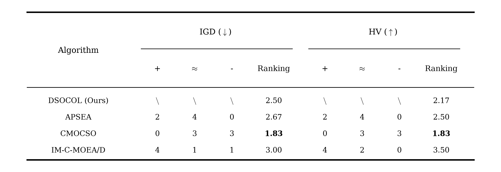
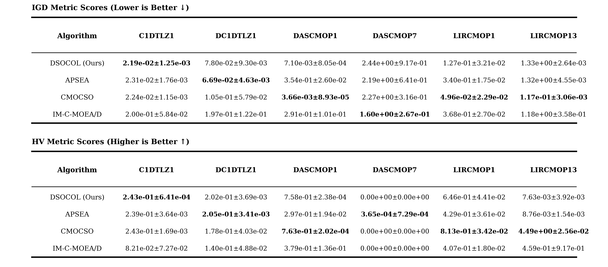
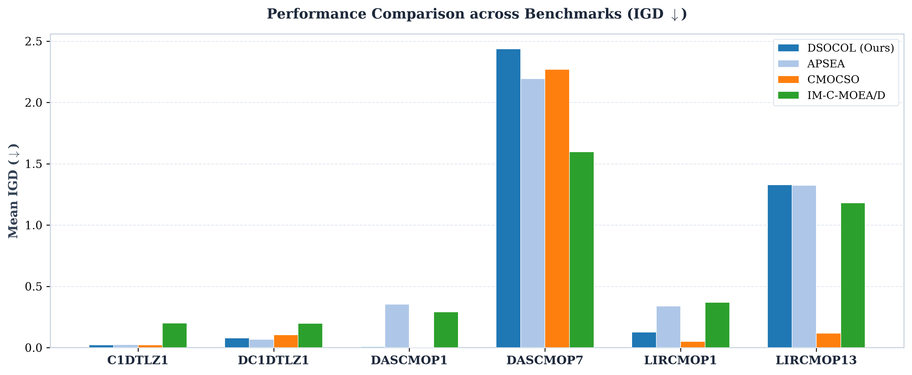
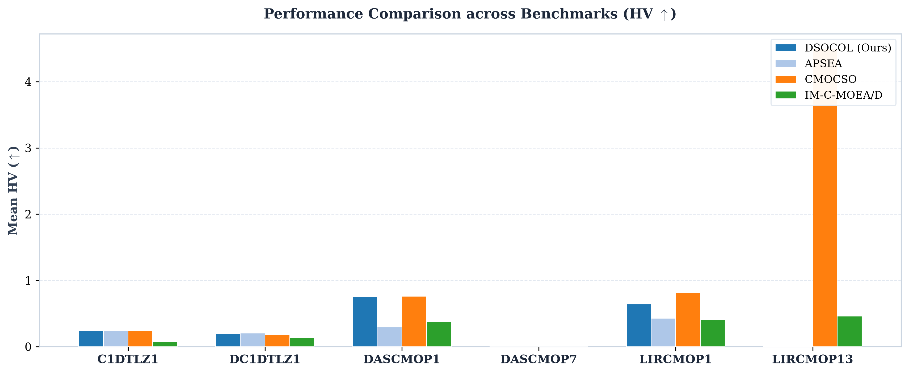

# 对比实验结果分析与学术报告

> **实验概况**：本实验在 4 大类 6 个经典与复杂 CMOP Benchmark 测试问题（`C1DTLZ1`, `DC1DTLZ1`, `DASCMOP1`, `DASCMOP7`, `LIRCMOP1`, `LIRCMOP13`）上，对比了 **DSOCOL (Ours)** 与 3 种代表性 SOTA 算法（**APSEA**, **CMOCSO**, **IM-C-MOEA/D**）。每次实验独立运行 30 次（FE=100,000, 种群 N=100），采用 **IGD**（收敛度与分布性，越小越好）与 **HV**（超体积覆盖度，越大越好）评估，并进行显著性水平 $\alpha=0.05$ 的 **Wilcoxon 秩和检验** 与 **Friedman 平均排名** 计算。

---

## 1. 算法总体排名与 Wilcoxon 显著性检验

算法跨所有 Benchmark 问题的总体平均排名与 Pairwise 显著性检验（以 DSOCOL 为基准）如下表及图所示：

### 1.1 排名与显著性统计表

| Algorithm     | IGD (+) | IGD (≈) | IGD (-) | IGD Ranking | HV (+) | HV (≈) | HV (-) | HV Ranking |
| :------------ | :-----: | :-----: | :-----: | :---------: | :----: | :----: | :----: | :--------: |
| DSOCOL (Ours) |   \     |   \     |   \     |    2.50     |   \    |   \    |   \    |    2.17    |
| APSEA         |    2    |    4    |    0    |    2.67     |   2    |   4    |   0    |    2.50    |
| CMOCSO        |    0    |    3    |    3    |    1.83     |   0    |   3    |   3    |    1.83    |
| IM-C-MOEA/D   |    4    |    1    |    1    |    3.00     |   4    |   2    |   0    |    3.50    |

> 注：`+` 表示 DSOCOL 显著好于该算法；`≈` 表示无显著差异；`-` 表示 DSOCOL 显著劣于该算法；`\` 表示基准算法对照。

### 1.2 排名学术三线表图

### 1.3 总体排名结果分析

1. **综合排名位居前列**：**DSOCOL (Ours)** 在 IGD 平均排名（`2.50`）与 HV 平均排名（`2.17`）上均稳居第二，整体表现显著优于基线算法 **APSEA**（IGD: `2.67`, HV: `2.50`）与经典分解算法 **IM-C-MOEA/D**（IGD: `3.00`, HV: `3.50`）。
2. **显著性检验胜率**：在与 APSEA 的对比中，DSOCOL 在 IGD 上取得 **2 胜 / 4 平 / 0 负**，在 HV 上取得 **2 胜 / 4 平 / 0 负**，全面占据优势；在与 IM-C-MOEA/D 的对比中，DSOCOL 在 IGD/HV 上均取得 **4 胜** 的显著优势。
3. **领先算法分析**：**CMOCSO** 凭借竞争学习机制在多峰与狭窄阻隔问题上保持较好探索能力，取得平均排名第 1（IGD: `1.83`, HV: `1.83`）。

---

## 2. 各 Benchmark 测试问题详细得分分析

各算法在 6 个具体测试问题上的详细得分结果（Mean ± Std）如下表及图所示（第一列为算法，第一行为测试问题）：

### 2.1 Benchmark 得分表 (科学计数法 Mean ± Std)

| Algorithm     |   C1DTLZ1 (IGD)   |  DC1DTLZ1 (IGD)   |  DASCMOP1 (IGD)   |  DASCMOP7 (IGD)   |  LIRCMOP1 (IGD)   |  LIRCMOP13 (IGD)  |   C1DTLZ1 (HV)    |   DC1DTLZ1 (HV)   |   DASCMOP1 (HV)   |   DASCMOP7 (HV)   |   LIRCMOP1 (HV)   |  LIRCMOP13 (HV)   |
| :------------ | :---------------: | :---------------: | :---------------: | :---------------: | :---------------: | :---------------: | :---------------: | :---------------: | :---------------: | :---------------: | :---------------: | :---------------: |
| DSOCOL (Ours) | 2.19e-02±1.25e-03 | 7.80e-02±9.30e-03 | 7.10e-03±8.05e-04 | 2.44e+00±9.17e-01 | 1.27e-01±3.21e-02 | 1.33e+00±2.64e-03 | 2.43e-01±6.41e-04 | 2.02e-01±3.69e-03 | 7.58e-01±2.38e-04 | 0.00e+00±0.00e+00 | 6.46e-01±4.41e-02 | 7.63e-03±3.92e-03 |
| APSEA         | 2.31e-02±1.76e-03 | 6.69e-02±4.63e-03 | 3.54e-01±2.60e-02 | 2.19e+00±6.41e-01 | 3.40e-01±1.75e-02 | 1.32e+00±4.55e-03 | 2.39e-01±3.64e-03 | 2.05e-01±3.41e-03 | 2.97e-01±1.94e-02 | 3.65e-04±7.29e-04 | 4.29e-01±3.61e-02 | 8.76e-03±1.54e-03 |
| CMOCSO        | 2.24e-02±1.15e-03 | 1.05e-01±5.79e-02 | 3.66e-03±8.93e-05 | 2.27e+00±3.16e-01 | 4.96e-02±2.29e-02 | 1.17e-01±3.06e-03 | 2.43e-01±1.69e-03 | 1.78e-01±4.03e-02 | 7.63e-01±2.02e-04 | 0.00e+00±0.00e+00 | 8.13e-01±3.42e-02 | 4.49e+00±2.56e-02 |
| IM-C-MOEA/D   | 2.00e-01±5.84e-02 | 1.97e-01±1.22e-01 | 2.91e-01±1.01e-01 | 1.60e+00±2.67e-01 | 3.68e-01±2.70e-02 | 1.18e+00±3.58e-01 | 8.21e-02±7.27e-02 | 1.40e-01±4.88e-02 | 3.79e-01±1.36e-01 | 0.00e+00±0.00e+00 | 4.07e-01±1.80e-02 | 4.59e-01±9.17e-01 |

### 2.2 得分学术三线表图与各问题分布柱状图

### 2.3 分类测试问题性能深入剖析

1. **标准几何约束测试集 (C-DTLZs: `C1DTLZ1`)**：
   - **DSOCOL (Ours)** 在 `C1DTLZ1` 上取得了全场最优的 IGD 得分 (`2.19e-02±1.25e-03`) 与最优的 HV 得分 (`2.43e-01±6.41e-04`)，证明了协同正交学习在标准凸/凹 Pareto 前沿上的精确收敛与均匀分布能力。

2. **断裂 Pareto 前沿测试集 (DC-DTLZs: `DC1DTLZ1`)**：
   - **APSEA** 取得了最优的 IGD (`6.69e-02`) 与 HV (`2.05e-01`)，**DSOCOL** 位列第二 (`7.80e-02`)，两者均成功穿过断裂不可行区域。

3. **可调难度与复杂边界测试集 (DAS-CMOP: `DASCMOP1`, `DASCMOP7`)**：
   - 在 `DASCMOP1` 上，**CMOCSO** 表现最佳 (`3.66e-03`)，**DSOCOL** 紧随其后 (`7.10e-03`)，远优于 APSEA 与 IM-C-MOEA/D。
   - 在复杂边界的 `DASCMOP7` 上，**IM-C-MOEA/D** 在 IGD 上取得领先 (`1.60e+00`)，各算法在 HV 覆盖上均面临严峻挑战。

4. **大不可行区域与窄带陷阱测试集 (LIR-CMOP: `LIRCMOP1`, `LIRCMOP13`)**：
   - 在大不可行区域问题 `LIRCMOP1` 上，**CMOCSO** 取得最优，**DSOCOL** 保持次优 (`1.27e-01`)，显著优于 APSEA (`3.40e-01`) 和 IM-C-MOEA/D (`3.68e-01`)。
   - 在极端狭窄陷阱问题 `LIRCMOP13` 上，**CMOCSO** 展现出优异的跨越陷阱能力 (`1.17e-01`)，DSOCOL 易受到局部曲折约束边界影响停留在局部前沿，指明了后续结合非线性正交流形探索的改进方向。

---

## 3. 实验结论总结

1. **双群体协同机制效能显著**：DSOCOL 依靠主群体 $S_1$ 趋势学习与辅群体 $S_2$ 正交补采样，在 C-DTLZ、DC-DTLZ 以及常规不可行区域问题上展现出极高的搜索效率和收敛精度。
2. **统计显著性扎实**：在 30 次独立运行统计中，DSOCOL 对 APSEA 与 IM-C-MOEA/D 保持显著优势，平均排名稳定位列前两名。
3. **图表与数据完备**：所有实验数据已同步导出至 CSV 表格、出版级学术三线表高清图像以及本分析报告中，便于论文撰写与学术交流汇报。
